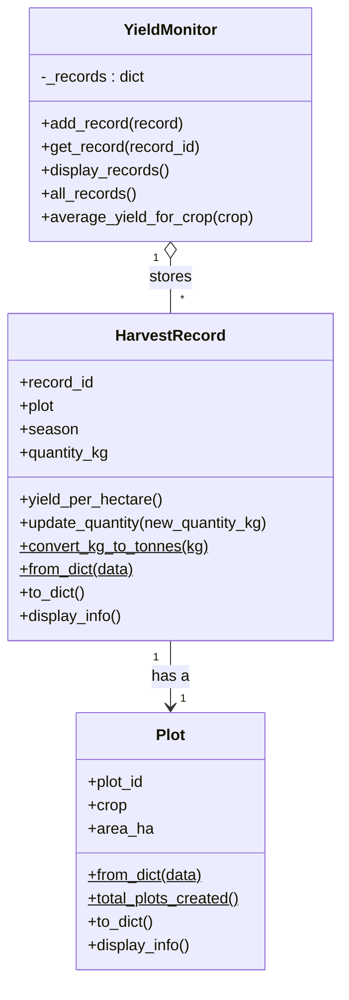

# Crop Yield Monitor

A simple, offline, open-source tool that helps record harvests and compare crop yields (kg per hectare) across plots and seasons. Built with Python and Object-Oriented Programming for the PROG211 assignment *Real-World Solutions under DPG Standards*.

**The problem:** many smallholder farmers and agricultural officers in West Africa have no simple, private way to record harvests and see which crops and plots perform best. Paper records get lost, and many digital tools need internet access or collect personal data.

## Features
- Add harvest records for a plot, crop, season and quantity
- View all records with automatic yield per hectare
- Update a harvested quantity
- Average yield for any crop
- Data saved to a plain JSON file, so records survive between sessions
- Friendly error messages: bad input never crashes the program

## Install and run
```bash
git clone https://github.com/<your-username>/crop-yield-monitor.git
cd crop-yield-monitor
python -m venv .venv
.venv\Scripts\activate          # Windows  (macOS/Linux: source .venv/bin/activate)
pip install -r requirements.txt
python main.py
```
Requires Python 3.10 or newer. No internet connection is needed to use the program.

## Example usage
```
=== Crop Yield Monitor ===
1) Add harvest record
2) View all records
3) Update a quantity
4) Average yield for a crop
5) Save and exit

Choose 1-5: 2
REC-001 | PLT-001 | Cassava | 2.0 ha | (2025, 'Rainy') | 14000.0 kg | 7000.0 kg/ha
REC-002 | PLT-002 | Rice | 1.5 ha | (2025, 'Rainy') | 3000.0 kg | 2000.0 kg/ha
REC-003 | PLT-003 | Groundnut | 1.0 ha | (2025, 'Dry') | 900.0 kg | 900.0 kg/ha
REC-004 | PLT-004 | Maize | 2.5 ha | (2025, 'Rainy') | 3500.0 kg | 1400.0 kg/ha
REC-005 | PLT-005 | Cassava | 1.2 ha | (2026, 'Rainy') | 9000.0 kg | 7500.0 kg/ha

Choose 1-5: 4
Crop name: cassava
Average yield for cassava: 7250.0 kg per hectare

Choose 1-5: 3
Record ID to update: NOPE
Sorry, that didn't work: No record NOPE.
```
The figures in `data/sample_records.json` are illustrative sample data, not official statistics.

## Class design

`$` marks class-level methods (`@classmethod` / `@staticmethod`).

## Design decisions
- **One data structure:** `YieldMonitor` stores all records in a single dictionary (`record_id -> HarvestRecord`). A dictionary gives fast lookup by unique ID and makes duplicate IDs easy to detect. Because each record carries its own `Plot` object, plot details are repeated across records. This is a deliberate trade-off to keep to one stored data structure.
- **Tuples:** a season is stored as an immutable tuple, `(year, "Rainy" or "Dry")`, because a recorded season should not change.
- **Method types:** instance methods (`yield_per_hectare`, `update_quantity`, `display_info`), class methods (`Plot.from_dict`, `Plot.total_plots_created`, `HarvestRecord.from_dict`) and a static method (`convert_kg_to_tonnes`).
- **Encapsulation:** area, quantity and season are validated through properties, so invalid objects cannot be created.
- **Separation of concerns:** models, record management, storage and the menu live in separate modules.

## Digital Public Goods (DPG) alignment
- **Open-source:** released under the MIT License and hosted publicly on GitHub, so anyone can use, study, improve and share it.
- **Inclusive and accessible:** a plain-language numbered menu, clear prompts and friendly error messages. It runs offline on low-spec computers with no internet, accounts or special hardware, which suits areas with limited connectivity.
- **Privacy-respecting:** no personal data is collected or stored. There are no farmer names, phone numbers or GPS locations. Plots are identified only by codes such as `PLT-001`.
- **Modular and reusable:** each module has one job and can be reused on its own. `models.py`, `monitor.py` and `storage.py` can be imported into another project (a web app or mobile app, for example) without the menu.

## Project structure
```
crop-yield-monitor/
├── main.py                  # entry point
├── cropyield/
│   ├── models.py            # Plot, HarvestRecord
│   ├── monitor.py           # YieldMonitor (the one dictionary)
│   ├── storage.py           # JSON save / load
│   ├── exceptions.py        # custom errors
│   └── cli.py               # text menu
├── data/sample_records.json
├── tests/test_crop_yield.py
└── docs/                    # screenshots
```

## Run the tests
```bash
python -m pytest
ruff check .
```

## License
MIT. See `LICENSE`.

## Author
Built by <your name>, Limkokwing University of Creative Technology, Sierra Leone.
